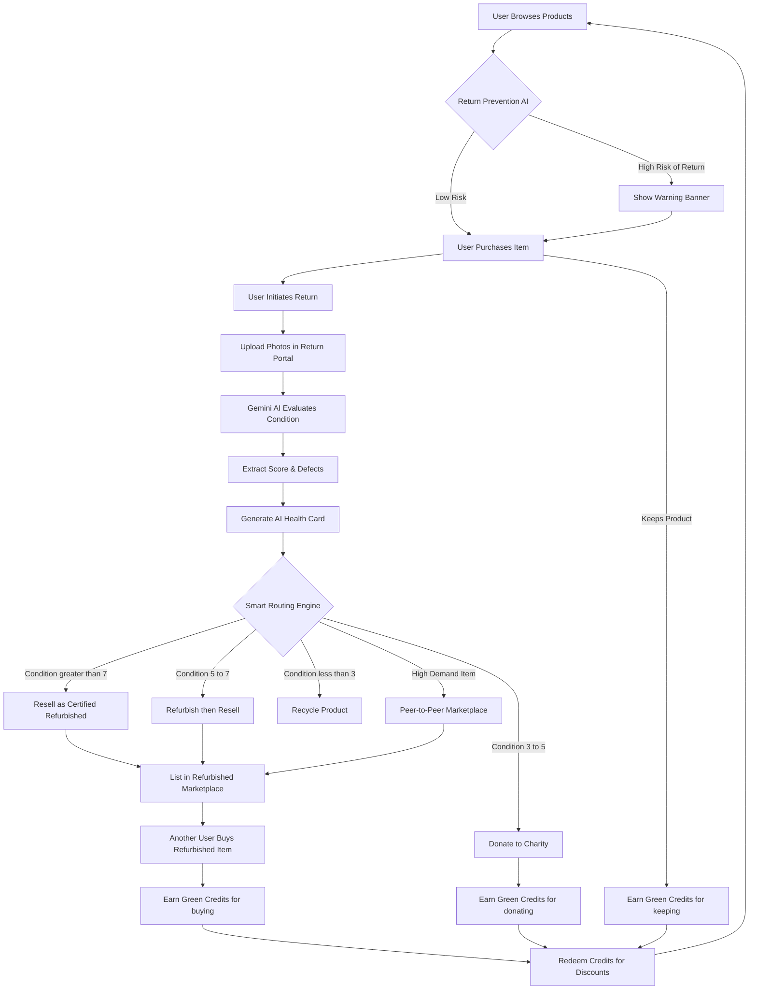
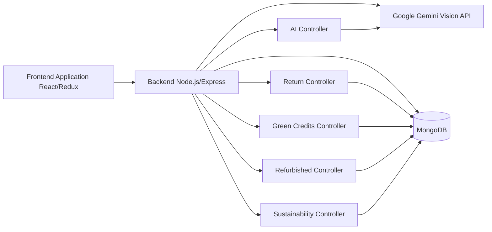
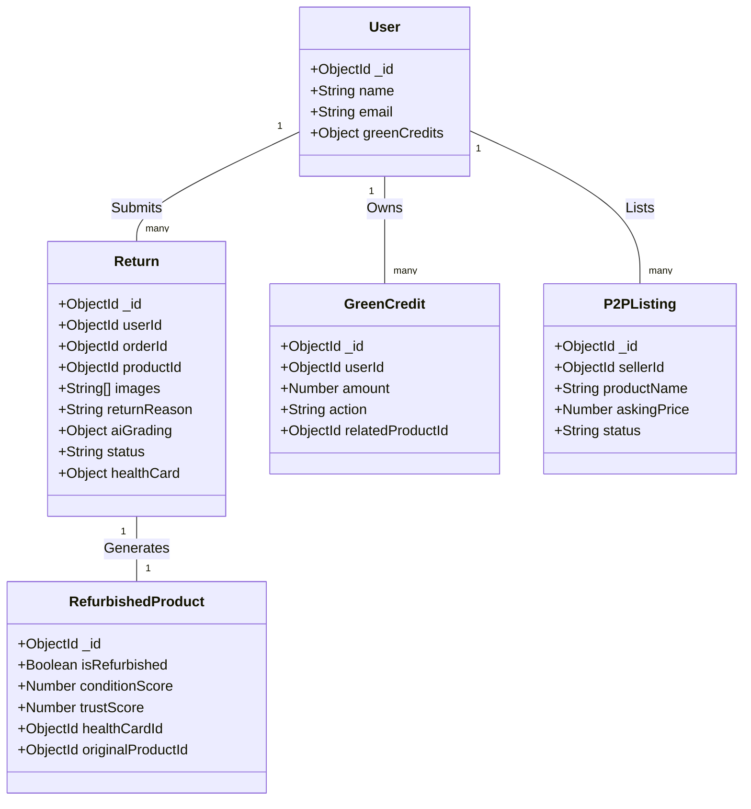

# Second Life Commerce: PRD Flow & System Architecture

## 1. Product Requirements Document (PRD) Flow Chart

```mermaid
flowchart TD
    Start[User Browses Products] --> RiskCheck{Return Prevention AI}
    RiskCheck -- High Risk of Return --> Warn[Show Warning Banner]
    RiskCheck -- Low Risk --> Buy[User Purchases Item]
    Warn --> Buy
    
    Buy --> InitiateReturn[User Initiates Return]
    InitiateReturn --> Upload[Upload Photos in Return Portal]
    
    Upload --> AIGrade[Gemini AI Evaluates Condition]
    AIGrade --> ExtractData[Extract Score & Defects]
    ExtractData --> HealthCard[Generate AI Health Card]
    
    HealthCard --> SmartRoute{Smart Routing Engine}
    
    SmartRoute -- Condition greater than 7 --> Resell[Resell as Certified Refurbished]
    SmartRoute -- Condition 5 to 7 --> Refurbish[Refurbish then Resell]
    SmartRoute -- Condition 3 to 5 --> Donate[Donate to Charity]
    SmartRoute -- Condition less than 3 --> Recycle[Recycle Product]
    SmartRoute -- High Demand Item --> P2P[Peer-to-Peer Marketplace]
    
    Resell --> ListRefurb[List in Refurbished Marketplace]
    Refurbish --> ListRefurb
    P2P --> ListRefurb
    
    ListRefurb --> BuyRefurb[Another User Buys Refurbished Item]
    
    BuyRefurb --> EarnCredits1[Earn Green Credits for buying]
    Donate --> EarnCredits2[Earn Green Credits for donating]
    Buy -- Keeps Product --> EarnCredits3[Earn Green Credits for keeping]
    
    EarnCredits1 --> Redeem[Redeem Credits for Discounts]
    EarnCredits2 --> Redeem
    EarnCredits3 --> Redeem
    
    Redeem --> Start
```

---

## 2. System Architecture Diagram

```mermaid
flowchart LR
    Frontend[Frontend Application React/Redux] --> Backend[Backend Node.js/Express]
    Backend --> Gemini[Google Gemini Vision API]
    Backend --> DB[(MongoDB)]
    
    Backend --> RC[Return Controller]
    Backend --> AC[AI Controller]
    Backend --> GCC[Green Credits Controller]
    Backend --> RefC[Refurbished Controller]
    Backend --> SC[Sustainability Controller]
    
    AC --> Gemini
    RC --> DB
    GCC --> DB
    RefC --> DB
    SC --> DB
```

---

## 3. Data Model (UML Class Diagram)

```mermaid
classDiagram
    class User {
        +ObjectId _id
        +String name
        +String email
        +Object greenCredits
    }
    
    class Return {
        +ObjectId _id
        +ObjectId userId
        +ObjectId orderId
        +ObjectId productId
        +String[] images
        +String returnReason
        +Object aiGrading
        +String status
        +Object healthCard
    }

    class GreenCredit {
        +ObjectId _id
        +ObjectId userId
        +Number amount
        +String action
        +ObjectId relatedProductId
    }

    class RefurbishedProduct {
        +ObjectId _id
        +Boolean isRefurbished
        +Number conditionScore
        +Number trustScore
        +ObjectId healthCardId
        +ObjectId originalProductId
    }

    class P2PListing {
        +ObjectId _id
        +ObjectId sellerId
        +String productName
        +Number askingPrice
        +String status
    }

    User "1" -- "many" Return : Submits
    User "1" -- "many" GreenCredit : Owns
    Return "1" -- "1" RefurbishedProduct : Generates
    User "1" -- "many" P2PListing : Lists
```
